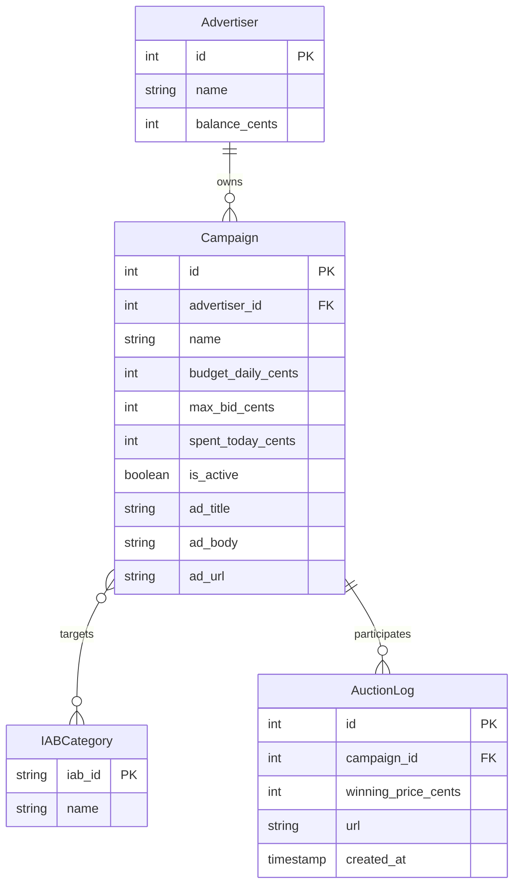

# 🎯 AdContext Engine — AI-Driven Contextual Ad Relevance & Bidding Platform

## 1. Overview
The AdContext Engine is a real-time, AI-powered contextual ad serving platform designed to evaluate web content and match it with the most relevant ad campaigns. Using advanced LLMs (like gpt-4o-mini), the system analyzes web pages or text on the fly, categorizing them according to the IAB Taxonomy. 

In a privacy-first world where third-party cookies are deprecated, contextual advertising is becoming critical. This platform provides an efficient, scalable, and highly relevant ad selection engine that benefits publishers (higher yield), advertisers (better targeting), and users (relevant, non-intrusive ads).

## 2. System Architecture

```mermaid
flowchart TD
    Client[Client Request] --> Gateway[FastAPI Gateway]
    Gateway --> Fetcher[Content Fetcher]
    Gateway --> Cache[(Redis Cache)]
    Fetcher --> Analyzer[Content Analyzer (LLM)]
    Analyzer --> Cache
    Cache --> Selector[Ad Selector]
    Selector --> Auction[Auction Engine]
    Auction --> DB[(PostgreSQL DB)]
    Auction --> Response[Ad Response]
    Response --> Gateway
    Gateway --> Client
```

## 3. Database Schema



## 4. Tech Stack

| Technology | Purpose | Why Chosen |
|------------|---------|------------|
| **FastAPI** | API Gateway | High performance (async), auto-generated OpenAPI docs, Pydantic integration. |
| **Python 3.10+** | Core Language | Robust ecosystem for AI/ML, easy to maintain. |
| **SQLAlchemy 2.0** | ORM | Async support, highly flexible database abstractions. |
| **PostgreSQL** | Primary DB | Reliable, handles high concurrency, JSONB support for unstructured data. |
| **Redis** | Caching | Ultra-low latency, TTL support for caching LLM responses and rate limiting. |
| **LLMs (OpenAI)**| Content Analysis | Superior contextual understanding compared to traditional NLP methods. |

## 5. Key Features
- **Real-time contextual ad matching** via LLMs.
- **Second-price (Vickrey) auction engine** ensuring fair market pricing.
- **Redis caching** for sub-millisecond repeated queries.
- **IAB taxonomy-based category classification** for industry standardization.
- **Full REST API** with built-in OpenAPI documentation.

## 6. Engineering Trade-offs

> [!IMPORTANT]
> **Latency vs. AI Accuracy:** We opted for faster, smaller LLMs (like `gpt-4o-mini`) rather than heavy models (like `gpt-4`). Sub-second response times are critical for ad serving. Additionally, Redis caching eliminates duplicate LLM calls for the same URL, heavily mitigating latency.
>
> **Consistency vs. Availability:** To handle high throughput, campaign budget tracking (`spent_today_cents`) uses eventual consistency. Precision reconciliation runs as asynchronous background jobs rather than locking rows during real-time ad serving.
>
> **Cache Strategy:** We implemented a write-through cache with TTL for content analysis. Hash-based cache keys ensure that significant content changes trigger a re-analysis.
>
> **Auction Mechanism:** A second-price auction mechanism encourages advertisers to bid their true maximum willingness to pay, simplifying bidding strategies and maximizing long-term marketplace health.
>
> **Architecture Structure:** A modular monolith was chosen for initial development velocity. It is structured such that components (like the Auction Engine or Content Analyzer) can easily be separated into distinct microservices when scale demands it.

## 7. Scaling Strategy (Media.net Scale)
To scale this to Media.net's multi-billion daily requests:
1. **Compute:** Horizontally scale FastAPI application workers behind robust load balancers (e.g., AWS ALB / NGINX).
2. **Caching:** Deploy a clustered Redis architecture for distributed caching globally.
3. **Database:** Transition to a primary-replica DB setup. Ad serving reads from replicas; campaign updates and auction logs write to the primary.
4. **Async Processing:** Offload auction logging and budget aggregation to an async task queue (like Celery + RabbitMQ or Kafka) to prevent database I/O from bottlenecking the main serving path.
5. **Edge Delivery:** Utilize a CDN to serve all ad creative assets, pushing them as close to the user as possible.

## 8. Getting Started

```bash
# 1. Clone the repository
git clone https://github.com/yourorg/adcontext-engine.git
cd adcontext-engine

# 2. Set up environment variables
cp .env.example .env
# Edit .env with your OPENAI_API_KEY and database URLs

# 3. Start services via Docker Compose
docker-compose up -d

# 4. Seed the database
python seed_data.py
```

## 9. API Documentation
Once running, visit `http://localhost:8000/docs` for the interactive Swagger UI.

**Example Request (Serve Ad by URL):**
```bash
curl -X POST "http://localhost:8000/api/v1/ads/serve/url" \
     -H "Content-Type: application/json" \
     -d '{"url": "https://example.com/tech-news", "max_ads": 2}'
```

## 10. Running Tests
Tests are written with `pytest` and support async testing.

```bash
pytest tests/ -v
```

## 11. Project Structure
```text
.
├── app/
│   ├── api/
│   │   ├── routes/
│   │   ├── __init__.py
│   │   └── dependencies.py
│   ├── models/
│   ├── schemas/
│   ├── services/
│   ├── utils/
│   ├── config.py
│   ├── database.py
│   └── main.py
├── tests/
├── README.md
└── seed_data.py
```
